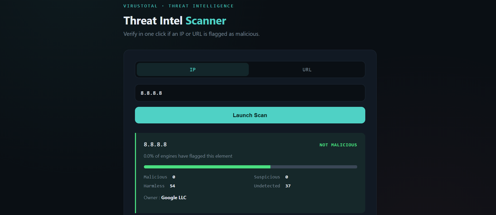

# IOC Enrichment & Threat Analysis Platform

A Python-based tool for analyzing **Indicators of Compromise (IOCs)** using the [VirusTotal API v3](https://developers.virustotal.com/reference/overview). Supports both a **CLI mode** and a **web interface (Flask)**.

Built as part of a cybersecurity internship at **ODDO BHF** — SOC team support tool.

---

##  Features

| Feature | Description |
|---|---|
|  IP Scan | Check if a single IP is malicious via VirusTotal |
|  URL Scan | Analyze a URL — submits it for analysis if not found in VT database |
|  File Scan | Batch scan IPs from a `.txt` file (supports defanged IPs like `1[.]2[.]3[.]4`) |
|  IP Range Scan | Scan all hosts in a CIDR range (e.g. `192.168.1.0/24`) |
|  Web Interface | Flask UI to scan IPs and URLs from the browser |
| Polling Logic | Auto-polls VT after URL submission until analysis is complete |

---

##  Screenshots

```
### Web Interface



###CLI

```
---

##  Project Structure

```
projet_stage/
│
├── scanner.py              # Main script (CLI + Flask)
├── templates/
│   └── index.html        # Flask web interface template
├── .env                  # API keys (not committed to git)
├── .gitignore
├── requirements.txt
└── README.md
```

---

##  Installation

### 1. Clone the repository

```bash
git clone https://github.com/your-username/ioc-enrichment-platform.git
cd ioc-enrichment-platform
```

### 2. Install dependencies

```bash
pip install -r requirements.txt
```

### 3. Configure your API key

Create a `.env` file at the root of the project:

```env
VT_API_KEY=your_virustotal_api_key_here
```

> Get your free API key at [virustotal.com](https://www.virustotal.com)

---

##  Usage

### CLI Mode

```bash
# Scan a single IP
python file1.py --ip 8.8.8.8

# Scan a URL
python file1.py --url example.com

# Scan a CIDR range
python file1.py --rangeip 192.168.1.0/24

# Scan IPs from a file
python file1.py --file iocs.txt
```

### Web Interface

```bash
python file1.py --web
```

Then open your browser at **http://127.0.0.1:5000**

---

##  Input File Format

The `--file` option accepts `.txt` files with one IP per line. Supports defanged format:

```
192.168.1.1
1[.]2[.]3[.]4 -> some comment
10.0.0.1
```

Private IPs are automatically skipped.

---

##  Security Notes

- Never commit your `.env` file — it's listed in `.gitignore`
- The free VirusTotal API is rate-limited to **4 requests/minute** — the tool includes `time.sleep(15)` between requests to stay within limits

---

##  Built With

- [Python 3.11](https://www.python.org/)
- [VirusTotal API v3](https://developers.virustotal.com/)
- [Flask](https://flask.palletsprojects.com/)
- [python-dotenv](https://pypi.org/project/python-dotenv/)

---

##  Author

**Syrine Guermazi** — Cybersecurity Intern @ ODDO BHF  
2ème année BIS — ISG Tunis
